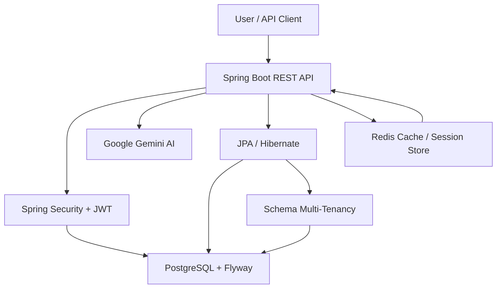

# Smart Task Management System

> **Live API:** https://smart-task-management-system-production.up.railway.app

A sophisticated, AI-powered task management platform built with Spring Boot, designed to revolutionize productivity through intelligent prioritization, multi-tenancy, and seamless user experiences. This project demonstrates advanced software engineering practices, integrating cutting-edge technologies to deliver a scalable, secure, and intelligent task management solution.

## 🚀 Features

- **AI-Powered Task Prioritization**: Leverages Google Gemini AI to intelligently analyze and prioritize tasks based on context, deadlines, and user behavior
- **Multi-Tenant Architecture**: Schema-based multi-tenancy ensuring data isolation and scalability for enterprise deployments
- **Robust Authentication & Security**: JWT-based authentication with Spring Security, including rate limiting and session management
- **Real-Time Notifications**: Integrated notification system for task updates and reminders
- **High-Performance Caching**: Redis-backed caching for optimal performance and session management
- **Database Migrations**: Flyway-powered database versioning for reliable schema evolution
- **Comprehensive Testing**: Integration tests with Testcontainers for PostgreSQL and Redis
- **Containerized Deployment**: Docker Compose setup for easy local development and deployment

## 🏗️ System Architecture



The application follows a layered architecture with clear separation of concerns:

### Core Components

- **Presentation Layer**: RESTful APIs built with Spring Web, exposing endpoints for task management, authentication, and AI services
- **Business Logic Layer**: Service classes handling domain logic, including AI integration via Google Gemini API
- **Data Access Layer**: JPA repositories with Hibernate for database operations, supporting multi-tenant schema isolation
- **Security Layer**: Spring Security with JWT tokens, rate limiting, and tenant-aware authentication
- **Infrastructure Layer**: Redis for caching and sessions, PostgreSQL with Flyway migrations

### Multi-Tenancy Implementation

Utilizes Hibernate's schema-based multi-tenancy, where each tenant has its own database schema. The system dynamically resolves tenant context from JWT tokens, ensuring complete data isolation while maintaining efficient resource utilization.

### AI Integration

The AI service integrates with Google Gemini 2.5 Flash model for intelligent task analysis. Tasks are prioritized based on multiple factors including urgency, complexity, dependencies, and user context, providing actionable insights for productivity optimization.

## 🛠️ Technology Stack

- **Backend**: Java 17, Spring Boot 3.3.12
- **Database**: PostgreSQL with Flyway migrations
- **Caching**: Redis for sessions and caching
- **Security**: Spring Security, JWT (JJWT)
- **AI**: Google Gemini API
- **Build Tool**: Maven
- **Testing**: JUnit 5, Testcontainers
- **Containerization**: Docker Compose
- **Development**: Lombok for boilerplate reduction

## 📋 Prerequisites

- Java 17 or higher
- Maven 3.6+
- Docker and Docker Compose
- Google Gemini API key (for AI features)

## 🚀 Getting Started

### 1. Clone the Repository

```bash
git clone <repository-url>
cd smart-task-management
```

### 2. Environment Setup

Create a `.env` file in the root directory:

```properties
GOOGLE_API_KEY=your_google_gemini_api_key_here
```

### 3. Start Infrastructure Services

```bash
docker-compose up -d
```

This will start PostgreSQL and Redis containers.

### 4. Build the Application

```bash
./mvnw clean compile
```

### 5. Run Database Migrations

```bash
./mvnw flyway:migrate
```

### 6. Run the Application

```bash
./mvnw spring-boot:run
```

The application will start on `http://localhost:8082`.

### 7. Verify Installation

Test the health endpoint:

```bash
curl http://localhost:8082/actuator/health
```

## 🌐 Live API

The application is deployed and available at:

https://smart-task-management-system-production.up.railway.app

## 📸 Screenshots

### Swagger API Documentation


### Deployment Success


### CI/CD Build Success


## 🧪 Testing

Run the full test suite including integration tests:

```bash
./mvnw test
```

Integration tests use Testcontainers to spin up isolated PostgreSQL and Redis instances.

## 📚 API Documentation

Interactive API documentation is available via Swagger UI:

**Swagger UI:** https://smart-task-management-system-production.up.railway.app/swagger-ui/index.html

### Authentication Endpoints

- `POST /api/auth/register` - User registration
- `POST /api/auth/login` - User authentication

### Task Management Endpoints

- `GET /api/tasks` - Retrieve user tasks
- `POST /api/tasks` - Create new task
- `PUT /api/tasks/{id}` - Update task
- `DELETE /api/tasks/{id}` - Delete task

### AI Endpoints

- `POST /api/ai/prioritize` - AI-powered task prioritization

Example AI prioritization request:

```json
{
  "tasks": [
    {
      "title": "Complete project proposal",
      "description": "Draft and finalize Q3 project proposal",
      "deadline": "2024-12-31",
      "estimatedHours": 8
    }
  ]
}
```

## 🔧 Configuration

Key configuration options in `application.yaml`:

- **Database**: PostgreSQL connection settings
- **Redis**: Caching and session configuration
- **AI**: Google Gemini model and API settings
- **Security**: JWT expiration, rate limiting thresholds
- **Server**: Port configuration (default: 8082)

## 🤝 Contributing

1. Fork the repository
2. Create a feature branch (`git checkout -b feature/amazing-feature`)
3. Commit your changes (`git commit -m 'Add amazing feature'`)
4. Push to the branch (`git push origin feature/amazing-feature`)
5. Open a Pull Request

## 📄 License

This project is licensed under the MIT License - see the LICENSE file for details.

## 🎯 Future Enhancements

- Real-time collaboration features
- Advanced AI insights and predictive analytics
- Mobile application development
- Integration with popular project management tools
- Enhanced reporting and analytics dashboard

---

*Built with passion for intelligent productivity solutions. Demonstrating expertise in modern Java development, AI integration, and scalable system design.*
